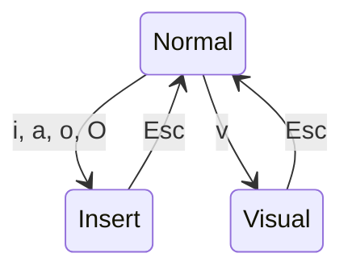

## はじめに

この記事はNeovim入門シリーズのPart 1だ。シリーズ全体の構成は以下の通り。


なお、この記事で紹介する操作や機能の多くはNeovimの前身であるVimから受け継いだものだが、このシリーズでは一貫して「Neovim」として説明する。Vimとの歴史的な関係は次のセクションで触れる。

## Neovimとは

Neovimは、テキストエディタ「Vim」から2014年にフォークされたプロジェクトだ。Vimは1991年にBram Moolenaarによって公開されたエディタで、さらにその前身であるvi（1976年、Bill Joy）まで遡ると、約50年の歴史を持つ操作体系の上に成り立っている（[Wikipedia: Vim](https://en.wikipedia.org/wiki/Vim_(text_editor))、[Wikipedia: Neovim](https://en.wikipedia.org/wiki/Neovim)）。

Neovimはその操作体系を引き継ぎつつ、Luaによる拡張性、非同期処理、LSP（Language Server Protocol）の標準サポートなど、モダンな開発に必要な機能を追加している。Vim独自のスクリプト言語（Vimscript）は学習コストが高く、ちょっと凝ったことをしようとすると途端に辛くなるが、NeovimではLuaという汎用言語で設定やプラグインを書けるため、プログラミング経験があれば直感的に理解しやすい。

## なぜNeovimなのか

VSCodeやJetBrains系のIDEが充実している今、なぜわざわざNeovimを使うのか。自分が感じているメリットを挙げる。

**キーボードだけで完結する。** Neovimはマウスを使わない前提で設計されている。ファイルの移動、検索、置換、ウィンドウ分割、すべてキーボードだけで完結する。手の移動がないから疲れにくいし、慣れると思考の速度でコードを操作できるようになる。

**ターミナルとの親和性が高い。** Neovimはターミナル上で動く。ターミナルエミュレータ（Ghostty、WezTermなど）やターミナルマルチプレクサ（tmuxなど、一つのターミナル内で複数のセッションやペインを管理するツール）と組み合わせることで、エディタ・ターミナル・ファイル操作を一つの画面で統合できる。SSHでリモートサーバーに入ってそのまま編集できるのも大きい。最近はClaude CodeのようにCLIで動くAIツールも増えてきていて、ターミナル中心のワークフローとの相性は今後さらに良くなっていくと思う。

**自分だけの環境を育てられる。** Neovimは最小限のエディタとして起動し、必要な機能をプラグインと設定で足していく。自分の開発スタイルに合った環境を一から構築する楽しさがある。dotfiles（設定ファイル群）をGitで管理して、どのマシンでも同じ環境を再現できるのもNeovimの文化だ。そして自分に合った設定を追求し始めるとどんどん沼にハマっていく。革製のスポーツシューズのように、最初は硬くて馴染まないが、使い込むほど自分の足にフィットして手放せなくなる感覚がある。

**コードを書くのがゲームみたいに楽しくなる。** これは使ってみないとわからないが、Neovimの操作体系にはゲーム的な快感がある。すべてのコマンドの前に数字をつけて「5行下に移動」「3単語削除」ができる。よく使う操作をマクロとして記録して、アルファベットキーの数だけ保存できる。直前の操作を `.` で繰り返せる。こうした操作が身体に馴染んでくると、コードの編集が本当に気持ちよくなる。

**学習コストについて。** 確かにNeovimには学習コストがある。ただ、いきなり全部をNeovimに移行する必要はない。最初はコードの編集だけNeovimでやってみて、慣れてきたらGUIでやっていた操作をひとつずつNeovimの設定に置き換えていく。そうやって段階的に移行していけば、生産性を落とさずに乗り換えられる。

## インストール

公式ドキュメントにOS別のインストール方法が記載されている。

- [Neovim公式: Installing Neovim](https://github.com/neovim/neovim/blob/master/INSTALL.md)

macOSなら `brew install neovim`、Arch Linuxなら `sudo pacman -S neovim` でインストールできる。

```sh
nvim --version
```

0.10以上であればこのシリーズの内容は問題なく動く。

## モーダル編集を理解する

Neovimを初めて使う人が最初に戸惑うのが**モーダル編集**だ。VSCodeでは、エディタを開いた瞬間から文字が入力できる。Neovimはそうではない。

Neovimには複数の「モード」があり、モードによってキーの役割が変わる。これは不便なのではなく、「入力」と「操作」を区別する設計だ。

コードを書いている時間を振り返ると、新しいコードをガーっと打ち込んでいる時間より、既存のコードを読んだり、移動したり、修正したりしている時間の方が長い。Neovimはその実態に合わせて、デフォルトのモードを「操作」にしている。入力したい時だけ入力モードに切り替える。

最初は「入力できない！」と焦るかもしれないが、これはそういうものだと思ってほしい。慣れの問題であって、使いにくい設計というわけではない。

覚えるべきモードは3つ。

### Normalモード

Neovimを起動すると最初にいるモード。このモードでは文字を入力せず、カーソル移動、コピー、削除、検索といった**操作**を行う。一番長くいるモード。

### Insertモード

文字を入力するモード。Normalモードで `i` を押すと入る。このモードでは普通のテキストエディタと同じように文字が入力できる。`Esc` でNormalモードに戻る。

### Visualモード

テキストを選択するモード。Normalモードで `v` を押すと入る。カーソルを動かすと選択範囲が広がり、選択した範囲に対してコピーや削除などの操作ができる。`Esc` でNormalモードに戻る。

### モードの行き来



この他に、Normalモードで `:` を押すと入るコマンドラインモードというものもある。保存（`:w`）や終了（`:q`）などのコマンドを実行するためのモードで、Normalモードの延長として使うものだが、名前として覚えておくといい。

今どのモードにいるかわからなくなったら、とりあえず `Esc` を押せばNormalモードに戻れる。迷ったらEsc。これだけ覚えておけばいい。

## 基本操作

ここからは実際にNeovimを起動して手を動かしながら読んでほしい。ターミナルで適当なファイルを開く。

```sh
nvim hello.txt
```

### カーソル移動（Normalモード）

矢印キーでも動くが、Neovimではホームポジションから手を動かさない `h` `j` `k` `l` を使う。

| キー | 方向 |
|------|------|
| `h`  | 左   |
| `j`  | 下   |
| `k`  | 上   |
| `l`  | 右   |

ゲームでWASDキーでキャラクターを動かすのと同じ感覚だ。カーソルが自分のキャラクターだと思えばいい。1〜2日で手が覚える。

さらに便利な移動コマンドもある。

| キー    | 動作                          |
|---------|------------------------------|
| `w`     | 次の単語の先頭に移動          |
| `b`     | 前の単語の先頭に移動          |
| `0`     | 行頭に移動                    |
| `$`     | 行末に移動                    |
| `gg`    | ファイルの先頭に移動          |
| `G`     | ファイルの末尾に移動          |
| `数字G` | 指定した行に移動（例: `42G`） |

### 編集（Normalモード）

Normalモードから直接テキストを操作できる。

| キー     | 動作                                  |
|----------|---------------------------------------|
| `i`      | カーソル位置の前からInsertモードに入る |
| `a`      | カーソル位置の後ろからInsertモードに入る |
| `o`      | 下に新しい行を作ってInsertモードに入る |
| `O`      | 上に新しい行を作ってInsertモードに入る |
| `x`      | カーソル位置の1文字を削除              |
| `dd`     | 1行削除                                |
| `yy`     | 1行コピー（yank）                      |
| `p`      | 貼り付け（put）                        |
| `u`      | 元に戻す（undo）                       |
| `Ctrl+r` | やり直す（redo）                       |

`dd` で削除した行は `p` で貼り付けられる。Neovimでは「削除」と「切り取り」が同じ動作になっている。

### 保存・終了（コマンドラインモード）

Normalモードで `:` を押すとコマンドラインモードに入る。ここにコマンドを打って実行する。

| コマンド | 動作             |
|----------|------------------|
| `:w`     | 保存             |
| `:q`     | 終了             |
| `:wq`    | 保存して終了     |
| `:q!`    | 保存せず強制終了 |

「Vimを終了できない」はプログラマの定番ネタだが、答えは `:q` だ。変更を保存したければ `:wq`、保存したくなければ `:q!`。

### 検索・置換

| 操作                    | 動作               |
|-------------------------|--------------------|
| `/文字列`               | 前方検索           |
| `n`                     | 次の検索結果に移動 |
| `N`                     | 前の検索結果に移動 |
| `:%s/置換前/置換後/g`   | ファイル全体で置換 |

## 数字 × コマンド：Neovimの面白さ

基本操作を覚えたところで、Neovimの面白さの片鱗を紹介しておく。

### カウント

Neovimではほぼすべてのコマンドの前に数字をつけられる。

| 操作   | 意味           |
|--------|----------------|
| `5j`   | 5行下に移動    |
| `3dd`  | 3行削除        |
| `10w`  | 10単語先に移動 |
| `2yy`  | 2行コピー      |

### ドットリピート

`.` を押すと、直前の編集操作を繰り返せる。`dd` で1行削除した後、別の行で `.` を押すとまた1行削除される。`ciw`（単語を置換）した後、他の同じ単語の上で `.` を押すと同じ置換が繰り返される。単純だが、これだけで編集効率が大きく変わる。

### マクロ

一連の操作を記録して再生できる。


マクロはアルファベットキーの数だけ保存できる。「この行をこう整形して次の行に移動する」という操作を記録して100回再生する、みたいなことが普通にできる。

カウント、ドットリピート、マクロ。この3つを組み合わせると、「ここからここまで消して、この形に書き換えて、同じ操作を10箇所に適用する」といったことが数秒でできるようになる。これがNeovimを使っていて一番楽しい瞬間だと思う。

## もっと練習したいなら：Tutor

Neovimには対話的なチュートリアルが組み込まれている。Neovimを開いて `:Tutor` と入力すると、操作を手を動かしながら学べるチュートリアルが起動する。

日本語版も用意されている。Neovim内で以下のコマンドを実行する。

```
:Tutor ja/vim-01-beginner
```

この記事で紹介した基本操作に加えて、テキストオブジェクトやオペレータの組み合わせなど、より実践的な操作も学べる。この記事を読んだ後に一度やっておくと、手が馴染む速度が上がると思う。

## Neovimを終了できた、その先へ

ここまでで、Neovimの基本的な操作は一通り使えるようになったはず。`i` で入力モードに入り、`Esc` で戻り、`hjkl` で移動し、`:wq` で保存して終了する。

この段階ではVSCodeの方が快適に感じると思う。それでいい。まずは普段のコード編集だけNeovimでやってみて、少しずつ慣れていこう。

次の[Part 2](/blog/neovim-intro-part2)では、Neovimの設定ファイル `init.lua` の構造と、設定に必要なLuaの基礎を解説する。
