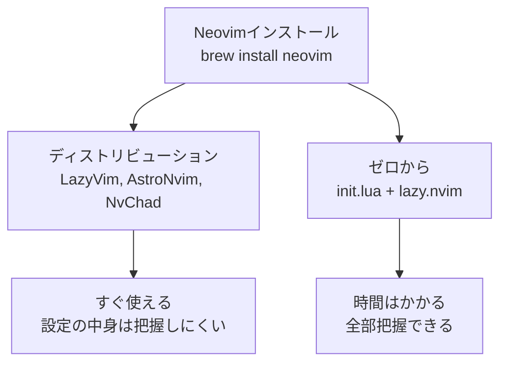
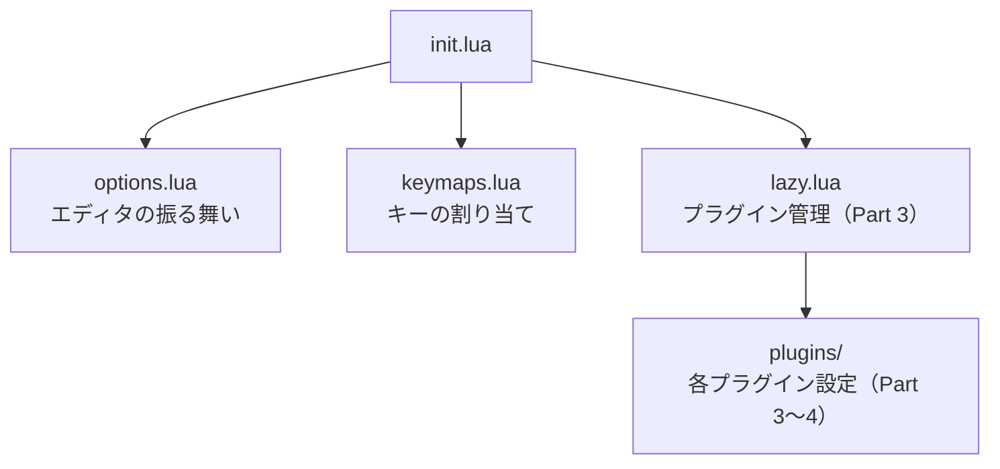

## はじめに

[Part 1](/blog/neovim-intro-part1)ではNeovimの基本操作を覚えた。Part 2では、Neovimの設定ファイルを書いてカスタマイズしていく。

ただ、その前にNeovimの設定にはいくつかのアプローチがあることを知っておく必要がある。

## 設定のアプローチ：ディストリビューション vs ゼロから

Neovimの設定には大きく2つのアプローチがある。

### ディストリビューション

[LazyVim](https://www.lazyvim.org/)、[AstroNvim](https://astronvim.com/)、[NvChad](https://nvchad.com/) などの構成済みセットをインストールする方法。プラグインもキーマップも最初から整っていて、インストールした瞬間にIDE的な環境が手に入る。

「とにかく早くNeovimを使いたい」「設定に時間をかけたくない」という人にはこのアプローチが向いている。

### ゼロから自分で組む

`init.lua` から全部自分で書く方法。プラグインマネージャとして [lazy.nvim](https://github.com/folke/lazy.nvim) を使い、必要なプラグインを一つずつ追加していく。

何が動いているか全部把握できるし、不要なものが入らない。トラブルが起きた時も原因を特定しやすい。Part 1で話した「自分だけの環境を育てる」楽しさは、こちらのアプローチで得られる。



**このシリーズではゼロから組むアプローチを取る。** 自分が使っている構成をベースに解説していく。ディストリビューションを否定するわけではなく、好みとスタイルの問題だ。

## init.lua

### 場所

Neovimの設定ファイルは `~/.config/nvim/init.lua` に置く。このファイルがNeovim起動時に最初に読み込まれる。

```sh
mkdir -p ~/.config/nvim
nvim ~/.config/nvim/init.lua
```

### ディレクトリ構成

設定を1ファイルに全部書くこともできるが、すぐに管理が辛くなる。自分は以下の構成にしている。

```
~/.config/nvim/
├── init.lua                  # エントリーポイント
├── lua/
│   └── config/
│       ├── options.lua       # エディタの基本設定
│       ├── keymaps.lua       # キーマップ
│       ├── lazy.lua          # プラグインマネージャの設定
│       └── plugins/          # 各プラグインの設定（Part 3で扱う）
│           ├── colorscheme.lua
│           ├── lsp.lua
│           └── ...
└── lazy-lock.json            # プラグインのバージョンロック
```

`init.lua` の中身はこれだけ。

```lua
require('config.options')
require('config.keymaps')
require('config.lazy')
```

`require` で各ファイルを読み込んでいる。他の言語でいう `import`（Cでは `#include`）と同じだ。`require('config.options')` は `lua/config/options.lua` を読み込む。

この構成のポイントは、関心の分離ができていること。基本設定、キーマップ、プラグインが別ファイルになっているので、何かを変えたい時にどこを見ればいいか迷わない。

## Luaの基礎

ここからは設定を書くために必要なLuaの文法を、実際のNeovim設定と紐づけて説明していく。Luaを網羅的に学ぶ必要はない。設定に使う範囲だけ押さえれば十分だ。

### 変数

```lua
local opt = vim.opt
```

`local` でローカル変数を宣言する。`local` をつけないとグローバル変数になるが、Neovimの設定では基本的に `local` をつける。`vim.opt` は何度も使うので、短い名前に入れておくと楽になる。

### 文字列

```lua
opt.fileencoding = 'utf-8'
```

文字列はシングルクォートでもダブルクォートでもいい。自分はシングルクォートで統一している。

### 真偽値

```lua
opt.number = true
opt.swapfile = false
```

`true` / `false`。そのまま。

### 数値

```lua
opt.tabstop = 2
opt.scrolloff = 8
```

こちらもそのまま。

### テーブル

Luaで最も重要なデータ構造。配列としてもオブジェクト（辞書）としても使える。

```lua
-- 配列的な使い方
opt.backspace = { 'indent', 'eol', 'start' }

-- オブジェクト的な使い方（キーと値のペア）
opt.listchars = { tab = '»-', trail = '-', eol = '↲' }
```

他の言語の配列やオブジェクトと同じ役割だが、Luaではどちらも「テーブル」という一つの構文で表現する。

### 関数

```lua
local map = vim.keymap.set

map('n', 'j', 'gj')
```

関数も変数に入れられる。`vim.keymap.set` は長いので `map` に入れて使っている。

関数の定義はこう書く。

```lua
local function greet(name)
    return 'Hello, ' .. name
end
```

`..` は文字列結合の演算子だ。

### require

```lua
require('config.options')
```

他のLuaファイルを読み込む。`lua/` ディレクトリからの相対パスをドット区切りで指定する。`.lua` の拡張子は省略する。

| require文 | 読み込まれるファイル |
|---|---|
| `require('config.options')` | `lua/config/options.lua` |
| `require('config.keymaps')` | `lua/config/keymaps.lua` |
| `require('config.lazy')` | `lua/config/lazy.lua` |

## vim.optで基本設定

Luaの基礎がわかったところで、実際の設定を見ていく。`lua/config/options.lua` に書く内容だ。

### 最小限の設定

まずはこれだけ書いてみてほしい。

```lua
local opt = vim.opt

-- 行番号
opt.number = true

-- インデント
opt.tabstop = 2
opt.shiftwidth = 2
opt.expandtab = true
opt.smartindent = true

-- 検索
opt.ignorecase = true
opt.smartcase = true
opt.hlsearch = true
opt.incsearch = true

-- 見た目
opt.termguicolors = true
opt.cursorline = true
opt.signcolumn = 'yes'
opt.scrolloff = 8
```

保存してNeovimを再起動すると、行番号が表示され、カーソル行がハイライトされるようになる。これだけで「自分で設定した」感覚が得られると思う。

### 各オプションの解説

設定の意味を理解しておくと、あとから自分で調整できるようになる。

**行番号**

```lua
opt.number = true
opt.relativenumber = true
```

`number` は行番号の表示。`relativenumber` は現在行からの相対行番号を表示する。`5j` で5行下に移動したいとき、目的の行まで何行あるか数えなくても相対行番号を見ればわかる。Part 1で紹介したカウントと組み合わせると便利。

**インデント**

```lua
opt.tabstop = 2
opt.shiftwidth = 2
opt.expandtab = true
opt.smartindent = true
```

`tabstop` はタブ文字を何文字幅で表示するかの設定。`shiftwidth` は `>>` や `<<` でインデントを変更するときの幅。`expandtab` はタブキーを押したときにタブ文字ではなくスペースを挿入する。`smartindent` は改行時に前の行のインデントに合わせて自動でインデントしてくれる。

**クリップボード**

```lua
opt.clipboard = 'unnamedplus'
```

Neovimのヤンク（コピー）をOSのクリップボードと共有する。この設定がないと、NeovimでコピーしたテキストをブラウザやSlackに貼り付けられないし、逆もできない。最初に入れておくべき設定の一つだと思う。

**検索**

```lua
opt.ignorecase = true
opt.smartcase = true
opt.hlsearch = true
opt.incsearch = true
```

`ignorecase` は `/search` で検索するときに大文字小文字を区別しない。ただし `smartcase` を併用すると、検索文字列に大文字が含まれている場合だけ区別するようになる。例えば `/hello` は `Hello` にもヒットするが、`/Hello` は `Hello` だけにヒットする。`hlsearch` は検索結果をハイライト表示、`incsearch` は文字を入力するたびにリアルタイムで検索結果を更新する。

**不可視文字の表示**

```lua
opt.list = true
opt.listchars = { tab = '»-', trail = '-', eol = '↲' }
```

通常は見えないタブ文字、行末の余分なスペース、改行を記号で表示する。コードレビューで「ここにゴミスペースが入ってるよ」と言われる前に気づけるようになる。

**スワップファイルとバックアップ**

```lua
opt.swapfile = false
opt.backup = false
opt.undofile = true
```

Neovimはデフォルトで編集中のファイルの一時コピー（スワップファイル）やバックアップファイルを自動で作成する。クラッシュ時の復旧に使えるが、Gitでバージョン管理している場合は不要なことが多い。自分はこれらを無効にして、代わりに `undofile` を有効にしている。`undofile` はundo履歴をファイルに保存する機能で、Neovimを閉じて再度開いた後でも `u` で変更を元に戻せる。

**その他**

```lua
opt.splitright = true      -- 垂直分割を右に開く（デフォルトは左）
opt.splitbelow = true      -- 水平分割を下に開く（デフォルトは上）
opt.mouse = 'a'            -- マウス操作を有効にする（移行期に便利）
opt.showmode = false       -- 画面下部のモード表示を消す（Part 3でステータスラインを入れると不要になる）
opt.updatetime = 250       -- 操作が止まってからプラグインが反応するまでの時間（ミリ秒）。デフォルトの4000msから短くする
```

## vim.keymap.setでキーマップ

キーマップは `lua/config/keymaps.lua` に書く。

### 基本構文

```lua
vim.keymap.set(モード, キー, 動作)
```

第1引数のモードは文字列で指定する。

| 文字列 | モード   |
|--------|----------|
| `'n'`  | Normal   |
| `'i'`  | Insert   |
| `'v'`  | Visual   |

「このモードでこのキーを押したら、この動作をする」という対応付けを定義する仕組みだ。

### リーダーキー

```lua
vim.g.mapleader = ' '
```

リーダーキーは、自分だけのショートカットの起点になるキーだ。`<leader>w` のように、リーダーキー + 何かのキーの組み合わせでショートカットを作れる。

自分はスペースキーをリーダーキーにしている。両手のどちらからでも押せるし、Normalモードではデフォルトで何もしないキーなので、上書きしても困らない。

### 実用的なキーマップ

```lua
vim.g.mapleader = ' '

local map = vim.keymap.set

-- Insertモードで jj を押すとNormalモードに戻る（Escに手を伸ばさなくていい）
map('i', 'jj', '<Esc>')

-- 表示行単位で移動する（長い行が折り返されている時に、見た目通りに上下移動する）
map('n', 'j', 'gj')
map('n', 'k', 'gk')

-- H / L で行頭・行末に移動（0 や $ より押しやすい）
map({'n', 'v'}, 'H', '^')
map({'n', 'v'}, 'L', '$')

-- リーダーキーで保存・終了（:w → スペース + w で保存）
map('n', '<leader>w', ':w<CR>')
map('n', '<leader>q', ':q<CR>')

-- Escで検索ハイライトを消す
map('n', '<Esc>', ':nohlsearch<CR>')

-- ウィンドウ分割（sv で縦分割、sh で横分割）
map('n', '<leader>sv', ':vsplit<CR>')
map('n', '<leader>sh', ':split<CR>')

-- ウィンドウ間の移動をCtrl + hjkl で
map('n', '<C-h>', '<C-w>h')
map('n', '<C-j>', '<C-w>j')
map('n', '<C-k>', '<C-w>k')
map('n', '<C-l>', '<C-w>l')

-- Visualモードでインデント変更後に選択を維持する
map('v', '<', '<gv')
map('v', '>', '>gv')

-- Visualモードで選択した行を上下に移動
map('v', '<A-j>', ":m '>+1<CR>gv=gv")
map('v', '<A-k>', ":m '<-2<CR>gv=gv")

-- 半ページスクロール時にカーソルを画面中央に保つ
map('n', '<C-d>', '<C-d>zz')
map('n', '<C-u>', '<C-u>zz')

-- 検索ジャンプ時にカーソルを画面中央に保つ
map('n', 'n', 'nzz')
map('n', 'N', 'Nzz')

-- 全選択
map('n', '<leader>a', 'gg<S-v>G')
```

全部を一度に入れる必要はない。最初は `jj` でEsc、`<leader>w` で保存あたりから始めて、使いながら足していけばいい。

### キーマップの読み方

一つ例を取り上げる。

```lua
map('v', '<A-j>', ":m '>+1<CR>gv=gv")
```

`'v'` はVisualモード、`'<A-j>'` は `Alt + j`、`":m '>+1<CR>gv=gv"` は実行されるコマンド。`:m '>+1` は選択範囲を1行下に移動するExコマンドで、`<CR>` はEnterキー、`gv=gv` は選択を復元してインデントを揃える。

最初は意味がわからなくていい。「こういう書き方で動作を割り当てられるんだな」という理解で十分だ。使っていくうちに読めるようになる。

## まとめ

ここまでで、Neovimの設定ファイルの構造を理解し、基本オプションとキーマップを自分で書けるようになった。



今の状態でも、行番号、インデント、検索ハイライト、クリップボード共有が効いていて、最低限快適に使える。ただ、ファイラー、構文ハイライト、補完といった機能はまだない。

次の[Part 3](/blog/neovim-intro-part3)では、プラグインマネージャ `lazy.nvim` を導入して、Neovimの見た目と機能を一気に拡張していく。
