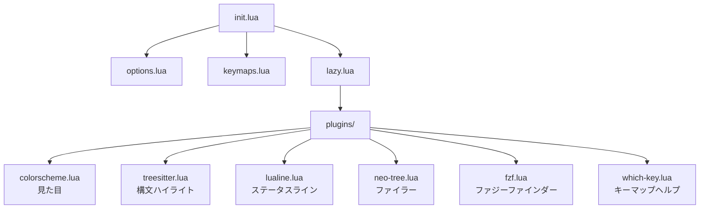

## はじめに

[Part 2](/blog/neovim-intro-part2)では `init.lua` の構造を理解し、基本オプションとキーマップを書いた。Part 3では、プラグインマネージャ `lazy.nvim` を導入して、Neovimの見た目と機能を拡張していく。

Part 2まではNeovim標準の機能だけを使っていた。ここからはプラグイン（有志が開発した拡張機能）を追加していく。VSCodeでいう拡張機能のインストールに相当する。

## lazy.nvimとは

[lazy.nvim](https://github.com/folke/lazy.nvim) は、Neovimのプラグインマネージャだ。プラグインのインストール、更新、削除、遅延読み込みを管理してくれる。

Neovimのプラグインマネージャには他にも [packer.nvim](https://github.com/wbthomason/packer.nvim) などがあるが、packerは現在メンテナンスされていない。自分はlazy.nvimを使っている。

## lazy.nvimの導入

Part 2で作った `lua/config/lazy.lua` にプラグインマネージャの設定を書く。まず全体を見てから、中身を詳しく説明していく。

```lua
local lazypath = vim.fn.stdpath('data') .. '/lazy/lazy.nvim'
if not vim.loop.fs_stat(lazypath) then
    vim.fn.system({
        'git', 'clone', '--filter=blob:none',
        'https://github.com/folke/lazy.nvim.git',
        '--branch=stable', lazypath,
    })
end
vim.opt.rtp:prepend(lazypath)

require('lazy').setup('config.plugins', {})
```

このコードは大きく3つのことをしている。

1. lazy.nvim本体がまだなければ、GitHubから自動でダウンロードする
2. Neovimがlazy.nvimを見つけられるようにする
3. lazy.nvimを起動して、プラグインの設定を読み込む

初回だけ自動でインストールされ、2回目以降はすぐにプラグインが読み込まれる仕組みだ。

### 最後の1行が一番大事

```lua
require('lazy').setup('config.plugins', {})
```

Part 2で `require` は他の言語でいう `import` だと説明した。ここでは `require('lazy')` でlazy.nvimを読み込み、その `setup()` 関数を呼び出している。他の言語っぽく書くとこんなイメージだ（これは実際のコードではなく、理解のための擬似コード）。

```
lazy = import('lazy')
lazy.setup('config.plugins')
```

Luaではこの2行を `require('lazy').setup(...)` と1行にまとめて書ける。

`setup` の第1引数 `'config.plugins'` は、`lua/config/plugins/` ディレクトリを指している。このディレクトリ内の全ての `.lua` ファイルを自動的にプラグイン設定として読み込んでくれる。つまり、プラグインを追加するときは `plugins/` 内に新しいファイルを作るだけでいい。

### ダウンロード部分の解説

```lua
local lazypath = vim.fn.stdpath('data') .. '/lazy/lazy.nvim'
```

`vim.fn.stdpath('data')` はNeovimのデータディレクトリのパスを返す（macOSなら `~/.local/share/nvim`）。`..` はPart 2で触れた文字列結合。つまり `lazypath` は `~/.local/share/nvim/lazy/lazy.nvim` になる。

```lua
if not vim.loop.fs_stat(lazypath) then
    vim.fn.system({
        'git', 'clone', '--filter=blob:none',
        'https://github.com/folke/lazy.nvim.git',
        '--branch=stable', lazypath,
    })
end
```

`vim.loop.fs_stat(lazypath)` でそのパスにファイルが存在するか確認し、存在しなければ `vim.fn.system` でgit cloneを実行してlazy.nvimをダウンロードする。つまり初回起動時だけダウンロードが走り、2回目以降はスキップされる。

```lua
vim.opt.rtp:prepend(lazypath)
```

`rtp` はruntime pathの略で、Neovimがプラグインを探すディレクトリのリスト。lazy.nvimのパスをここに追加して、Neovimがlazy.nvimを見つけられるようにしている。

## プラグイン設定の書き方

ここが一番大事なところだ。lazy.nvimのプラグイン設定がどういう構造になっているか理解しておくと、あとから自分でプラグインを追加できるようになる。

### 基本の形

```lua
return {
  {
    'GitHubのユーザー名/リポジトリ名',
  },
}
```

Part 2で、`require` は指定したファイルを読み込むものだと説明した。lazy.nvimは `plugins/` ディレクトリ内の各ファイルを読み込んで、そのファイルが `return` で返すテーブルを受け取る。このテーブルの中にプラグインの情報を書く。

テーブルが二重になっている（`return { { ... } }`）のは、外側のテーブルが「このファイルのプラグイン一覧」、内側のテーブルが「個々のプラグインの設定」という構造になっているためだ。つまり技術的には1つのファイルに複数のプラグインを書くこともできるが、自分は管理のしやすさから1ファイル1プラグインにしている。

### config：プラグインの設定

ほとんどのプラグインは「読み込んだ後に初期設定を行う」必要がある。その初期設定を書く場所が `config` だ。

```lua
return {
  {
    'folke/tokyonight.nvim',
    config = function()
      vim.cmd.colorscheme('tokyonight')
    end,
  },
}
```

`config` にはプラグインが読み込まれた後に実行される関数を書く。この中でプラグインの初期設定やキーマップの登録を行う。

ここで使っている `vim.cmd.colorscheme('tokyonight')` について触れておく。`vim.cmd` は、Part 1で紹介したコマンドラインモード（`:` の後に打つコマンド）をLuaから実行するものだ。つまり `vim.cmd.colorscheme('tokyonight')` は、コマンドラインモードで `:colorscheme tokyonight` と打つのと同じことをしている。

なお、`vim.` で始まる関数やオブジェクトは、Neovimが提供するLua APIだ。Part 2で使った `vim.opt`（オプション設定）や `vim.keymap.set`（キーマップ）も同じ仕組みで、Neovimの機能をLuaから操作するためのものになっている。

### config内でよく見るパターン

`config` の中身はプラグインによって異なる。上のカラースキームの例では `vim.cmd` を使ったが、多くのプラグインは以下のパターンで初期化する。

```lua
config = function()
  require('プラグイン名').setup({
    -- ここにプラグイン固有の設定を書く
  })
end,
```

`require` でプラグインを読み込み、`setup()` で初期設定を行う。`setup` に渡すテーブルの中身はプラグインごとに異なる。何が書けるかはプラグインのGitHubリポジトリのREADMEに記載されている。

このパターンはこの後のプラグインで何度も出てくる。ただし、全てのプラグインがこの形とは限らないので、必ずREADMEを確認してほしい。

### priority：読み込み順序

```lua
priority = 1000,
```

`priority` は数値が大きいほど先に読み込まれる。デフォルトは `50` だ。

カラースキームに `1000` を指定しているのは、他の全てのプラグインより先に読み込みたいためだ。カラースキームが適用される前に他のプラグインのUIが表示されると、一瞬だけNeovimのデフォルト配色（白背景に黒文字のようなシンプルな見た目）が表示されてから指定したテーマに切り替わってしまう。

実用的には、カラースキームだけ `1000` にしておけば問題ないと思う。他のプラグインで `priority` を指定する場面は自分の経験ではほぼない。READMEで指定するよう書かれている場合はその通りにすればいい。

### lazy と event：読み込みタイミング

```lua
lazy = false,         -- Neovim起動時にすぐ読み込む
event = 'VeryLazy',   -- 起動処理が終わった後に読み込む
```

プラグインの数が増えると、すべてを起動時に読み込むとNeovimの起動が遅くなる。lazy.nvimは名前の通り、プラグインの読み込みを「必要になるまで遅延させる」ことができる。

`lazy = false` は遅延させずに起動時にすぐ読み込む。カラースキームのように最初から必要なプラグインに使う。

`event` は特定のタイミングで読み込む設定だ。

| event | いつ読み込まれるか |
|---|---|
| `'VeryLazy'` | Neovimの起動処理が一通り終わった後 |
| `'BufReadPost'` | ファイルを開いた時 |
| `'InsertEnter'` | Insertモードに入った時 |

例えば、キーマップのヘルプ表示（which-key）は起動直後には使わないので、`event = 'VeryLazy'` にしておくと起動速度に影響しない。どの `event` を使うべきかはプラグインのREADMEに推奨値が書いてあることが多い。

### dependencies：依存プラグイン

```lua
dependencies = { 'nvim-tree/nvim-web-devicons' },
```

そのプラグインが動作するために必要な他のプラグインを指定する。lazy.nvimが依存プラグインを先にインストール・読み込みしてくれる。

何を指定すればいいかは自分で考える必要はない。プラグインのGitHubリポジトリのREADMEに必要な依存が記載されている。READMEのInstallationセクションをそのまま書き写せば動く。

### build：インストール時のコマンド

```lua
build = ':TSUpdate',
```

プラグインのインストールや更新時に自動実行するコマンド。プラグイン本体とは別にデータのダウンロードが必要なものに使う。こちらもREADMEに記載がある場合にのみ書けばいい。

## プラグインの探し方・調べ方

プラグインを自分で追加できるようになるために、探し方と調べ方を知っておくことが大事だ。

### プラグインを探す

- [awesome-neovim](https://github.com/rockerBOO/awesome-neovim) — Neovimプラグインがカテゴリ別にまとまっているリポジトリ
- GitHubで `neovim plugin` と検索する
- 他の人のdotfilesリポジトリの `plugins/` を覗いてみる

### プラグインの設定方法を調べる

プラグインを見つけたら、そのGitHubリポジトリの**README**を読む。READMEには以下の情報が書かれている。

- **Installation** — lazy.nvim用の設定例がそのまま載っていることが多い。これを `plugins/` 内の新しいファイルにコピーすれば動く
- **Dependencies** — `dependencies` に何を書けばいいか
- **Configuration** — `setup({})` に渡せるオプションの一覧
- **Usage** — コマンドやキーマップ

また、プラグインをインストールした後であれば、Neovim内で `:help プラグイン名` と入力すると詳細なドキュメントが読めるものもある。設定を変えたくなったときに参考になる。

つまり流れとしてはこうなる。


ここからは実際にプラグインを追加していく。

## カラースキーム

最初に入れるのはカラースキームだ。見た目が変わるとモチベーションが上がる。

`lua/config/plugins/colorscheme.lua` を作成する。

```lua
return {
  {
    'folke/tokyonight.nvim',
    lazy = false,
    priority = 1000,
    config = function()
      vim.cmd.colorscheme('tokyonight')
    end,
  },
}
```

ここまでの内容で、このコードが読めるようになっているはずだ。`'folke/tokyonight.nvim'` はGitHubリポジトリの指定、`lazy = false` で起動時にすぐ読み込み、`priority = 1000` で他のプラグインより先に読み込み、`config` 内の `vim.cmd.colorscheme('tokyonight')` でカラースキームを適用している。

自分は [tokyonight.nvim](https://github.com/folke/tokyonight.nvim) を使っている。他には [catppuccin](https://github.com/catppuccin/nvim)、[gruvbox](https://github.com/ellisonleao/gruvbox.nvim)、[kanagawa](https://github.com/rebelot/kanagawa.nvim) などがある。GitHubで `neovim colorscheme` と検索して好みのテーマを探してみてほしい。

Neovimを再起動すると、lazy.nvimが自動的にプラグインをインストールし、カラースキームが適用される。

## Treesitter：構文ハイライト

[nvim-treesitter](https://github.com/nvim-treesitter/nvim-treesitter) は、ソースコードを構文解析して、キーワード、関数名、文字列などを正確に色分けしてくれるプラグインだ。

Neovimにもデフォルトのハイライト機能はあるが、正規表現ベースで精度が低い。Treesitterはコードを構文木（Abstract Syntax Tree、AST）として解析するので、ネストした構造や複雑な文法も正しく色分けできる。

`lua/config/plugins/treesitter.lua` を作成する。

```lua
return {
  {
    'nvim-treesitter/nvim-treesitter',
    build = ':TSUpdate',
    config = function()
      require('nvim-treesitter').setup({
        ensure_installed = {
          'lua', 'go', 'python', 'typescript', 'javascript',
          'tsx', 'html', 'css', 'json', 'bash',
        },
        highlight = { enable = true },
        indent = { enable = true },
      })
    end,
  },
}
```

`config` の中で `require('nvim-treesitter').setup({})` を呼んでいる。先ほど説明した「`require` でプラグインを読み込み、`setup` で初期設定を行う」パターンだ。

`ensure_installed` には構文解析したい言語を列挙する。ここに書いた言語のパーサー（構文解析器）が自動的にダウンロードされる。自分が使う言語に合わせて追加・削除すればいい。

`highlight = { enable = true }` で構文ハイライトを有効にし、`indent = { enable = true }` でTreesitterベースの自動インデントを有効にしている。

再起動すると、Luaファイルやその他の対応言語のハイライトが格段に良くなるのがわかると思う。

## lualine：ステータスライン

[lualine.nvim](https://github.com/nvim-lualine/lualine.nvim) は、画面下部のステータスラインをカスタマイズするプラグインだ。現在のモード、ファイル名、Gitブランチ名、エンコーディングなどを表示してくれる。

Part 2で `opt.showmode = false` にしたのは、lualineにモード表示を担当させるためだ。

`lua/config/plugins/lualine.lua` を作成する。

```lua
return {
  {
    'nvim-lualine/lualine.nvim',
    dependencies = { 'nvim-tree/nvim-web-devicons' },
    config = function()
      require('lualine').setup({
        options = {
          theme = 'tokyonight',
        },
      })
    end,
  },
}
```

`dependencies` に指定している `nvim-web-devicons` は、ファイルタイプに応じたアイコンを表示するプラグインだ。lualineだけでなく、この後紹介するファイラーやファジーファインダーも共通で使う。lazy.nvimが自動的にインストールしてくれるので、自分で別途設定する必要はない。

`theme` にはカラースキームに合わせた値を指定する。tokyonightを使っているなら `'tokyonight'` でいい。使っているカラースキームの名前をそのまま入れれば大抵は対応している。

**Nerd Fontについて。** lualineやファイラーでアイコンを正しく表示するには、Nerd Fontに対応したフォントが必要だ。Nerd Fontとは、通常のプログラミングフォントにファイルアイコンや記号を追加したフォントのこと。[nerdfonts.com](https://www.nerdfonts.com/) からダウンロードできる。フォントの設定方法はお使いのターミナルエミュレータによって異なるので、それぞれのドキュメントを確認してほしい。Nerd Font対応フォントを使っていないとアイコン部分が文字化けする。

## Neo-tree：ファイラー

[neo-tree.nvim](https://github.com/nvim-neo-tree/neo-tree.nvim) は、Neovim内でファイルツリーを表示するプラグインだ。VSCodeの左側にあるエクスプローラーのようなもの。

`lua/config/plugins/neo-tree.lua` を作成する。

```lua
return {
  {
    'nvim-neo-tree/neo-tree.nvim',
    branch = 'v3.x',
    dependencies = {
      'nvim-lua/plenary.nvim',
      'nvim-tree/nvim-web-devicons',
      'MunifTanjim/nui.nvim',
    },
    config = function()
      require('neo-tree').setup({
        default_component_configs = {
          icon = {
            folder_closed = '',
            folder_open = '',
            folder_empty = '',
            default = '',
          },
          git_status = {
            symbols = {
              added = 'A',
              modified = 'M',
              deleted = 'D',
              renamed = 'R',
              untracked = 'U',
              ignored = 'I',
              unstaged = '!',
              staged = '+',
              conflict = 'C',
            },
          },
        },
        window = {
          position = 'float',
        },
        filesystem = {
          filtered_items = {
            visible = true,
            hide_dotfiles = false,
          },
        },
      })

      vim.keymap.set('n', '<leader>e', '<cmd>Neotree toggle<CR>', { desc = 'Toggle Neo-tree' })
    end,
  },
}
```

設定量が多いが、やっていることはシンプルだ。一つずつ見ていく。

`dependencies` に3つのプラグインが指定されている。これらはNeo-treeのREADMEに必要な依存として記載されているものだ。`plenary.nvim` は多くのプラグインが共通で使うユーティリティライブラリ、`nvim-web-devicons` はアイコン、`nui.nvim` はUIコンポーネントのライブラリ。

`setup({})` の中身は見た目や動作のカスタマイズだ。`icon` でフォルダアイコンの文字を指定し、`git_status.symbols` でGitのステータス表示をアルファベットにしている（ファイルを追加したら `A`、変更したら `M`）。

`window.position = 'float'` はファイルツリーをフローティングウィンドウ（画面の上に重ねて表示するウィンドウ）で開く設定。`'left'` にすると左サイドバーとして固定表示になる。好みで変えればいい。

`filtered_items` の設定で、ドットファイル（`.gitignore` など `.` で始まるファイル）も表示するようにしている。デフォルトでは隠されるが、自分はドットファイルを扱うことが多いので表示しておく方が使いやすいと思っている。

最後の `vim.keymap.set` で `<leader>e` にファイルツリーの開閉を割り当てている。<br>
`{ desc = 'Toggle Neo-tree' }` はwhich-key（後述）のポップアップに表示される説明文だ。

## fzf-lua：ファジーファインダー

[fzf-lua](https://github.com/ibhagwan/fzf-lua) は、ファイル名やファイル内容をあいまい検索（ファジー検索）できるプラグインだ。ファイル名の一部を入力するだけで候補が絞られていく。

プロジェクト内のファイルを開くとき、ファイルツリーを辿るよりファジーファインダーで検索する方が圧倒的に速い。自分が一番よく使うプラグインの一つだと思う。

`lua/config/plugins/fzf.lua` を作成する。

```lua
return {
  {
    'ibhagwan/fzf-lua',
    dependencies = { 'nvim-tree/nvim-web-devicons' },
    config = function()
      require('fzf-lua').setup({
        keymap = {
          fzf = {
            ['ctrl-j'] = 'down',
            ['ctrl-k'] = 'up',
          },
        },
        actions = {
          files = {
            ['default'] = require('fzf-lua.actions').file_edit,
          },
        },
      })

      local map = vim.keymap.set
      map('n', '<leader>ff', '<cmd>FzfLua files<CR>', { desc = 'Find Files' })
      map('n', '<leader>fg', '<cmd>FzfLua live_grep<CR>', { desc = 'Live Grep' })
      map('n', '<leader>fb', '<cmd>FzfLua buffers<CR>', { desc = 'Buffers' })
      map('n', '<leader>fh', '<cmd>FzfLua help_tags<CR>', { desc = 'Help Tags' })
    end,
  },
}
```

`setup` 内の `keymap.fzf` で、検索結果の一覧を `Ctrl+j` / `Ctrl+k` で上下移動できるようにしている。Neovimの `j` / `k` と同じ感覚で操作できる。

キーマップは4つ設定している。

| キー | 動作 |
|---|---|
| `<leader>ff` | ファイル名で検索 |
| `<leader>fg` | ファイル内容をgrepで検索（プロジェクト全体からテキストを探す） |
| `<leader>fb` | 開いているバッファ（ファイル）の一覧 |
| `<leader>fh` | Neovimのヘルプを検索 |

`<leader>ff`（スペース → f → f）でファイル検索が起動する。ファイル名の一部を入力すると候補がリアルタイムで絞られ、`Enter` で選択して開く。VSCodeでいう `Ctrl+P`（macOSなら `Cmd+P`）に相当する操作だ。`<leader>fg` はプロジェクト全体のテキスト検索で、VSCodeの `Ctrl+Shift+F` に近い。

ファジーファインダーのプラグインとしては他に [telescope.nvim](https://github.com/nvim-telescope/telescope.nvim) もある。自分はfzf-luaを使っている。

## which-key：キーマップヘルプ

[which-key.nvim](https://github.com/folke/which-key.nvim) は、キーを押した後に続くキーの候補をポップアップで表示してくれるプラグインだ。

例えば `<leader>`（スペース）を押して少し待つと、`w`（保存）、`q`（終了）、`e`（ファイラー）、`f`（ファジーファインダー）などの候補が `desc` の説明文とともに表示される。キーマップを覚えきれていない段階では特に助かる。

`lua/config/plugins/which-key.lua` を作成する。

```lua
return {
  {
    'folke/which-key.nvim',
    event = 'VeryLazy',
    config = function()
      require('which-key').setup()
    end,
  },
}
```

設定はデフォルトのままで十分だ。`event = 'VeryLazy'` にしているのは、起動直後に必要なプラグインではないので、遅延読み込みにして起動速度に影響しないようにするためだ。

which-keyを入れると、これまでのキーマップに書いてきた `desc`（`{ desc = 'Find Files' }` など）がポップアップに表示されるようになる。キーマップを追加するときは `desc` を書く癖をつけておくと、自分でも後から何のキーマップだったか思い出しやすい。

## ここまでの構成

Part 3で追加したファイルを含めた全体のディレクトリ構成はこうなっている。

```
~/.config/nvim/
├── init.lua
├── lua/
│   └── config/
│       ├── options.lua
│       ├── keymaps.lua
│       ├── lazy.lua
│       └── plugins/
│           ├── colorscheme.lua
│           ├── treesitter.lua
│           ├── lualine.lua
│           ├── neo-tree.lua
│           ├── fzf.lua
│           └── which-key.lua
└── lazy-lock.json
```



Neovimを再起動すると、lazy.nvimが全プラグインを自動的にインストールする。初回は少し時間がかかるが、次回以降はすぐに起動する。

## プラグインの管理コマンド

lazy.nvimには管理用のUIがある。Neovim内で `:Lazy` と入力すると管理画面が開く。

| コマンド | 意味 |
|---|---|
| `:Lazy` | 管理画面を開く |
| `:Lazy update` | 全プラグインを更新 |
| `:Lazy sync` | インストール・更新・削除をまとめて実行 |
| `:Lazy clean` | 設定から削除されたプラグインをアンインストール |

プラグインを削除したい場合は、`plugins/` 内の該当ファイルを消して `:Lazy clean` を実行すればいい。

## まとめ

Part 3では、lazy.nvimの導入からプラグインの追加まで一通り行った。ここまでで、カラースキーム、構文ハイライト、ステータスライン、ファイラー、ファジーファインダー、キーマップヘルプが使えるようになった。

ここで紹介したのは自分が使っているプラグインの一部だ。他にも便利なプラグインはたくさんあるので、「プラグインの探し方・調べ方」セクションで紹介した流れで、自分の使い方に合わせて `plugins/` にファイルを追加していってほしい。

次のPart 4では、LSP（Language Server Protocol）を導入する。LSPはエディタとプログラミング言語の解析サーバーをつなぐ仕組みで、コード補完、定義ジャンプ、エラー表示などの機能を提供してくれる。Part 3のTreesitterが「コードを正しく色分けする」ためのものだったのに対して、LSPは「コードの意味を理解して開発を支援する」ためのもの。Neovimが本格的な開発環境になる最後のピースだ。
